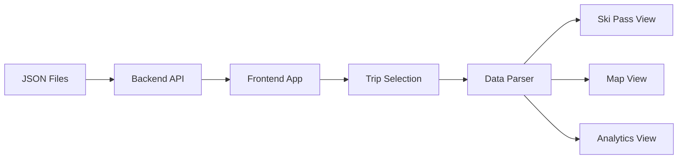

# Ski Resort Companion - Implementation Plan

## Project Overview
Build a web application that serves as a digital ski pass and slope tracker/analyzer for ski resort visitors.

## Architecture

### Backend (Node.js + Express)
- **Purpose**: Serve trip JSON data to the frontend
- **Technology**: Node.js, Express, CORS
- **Endpoints**:
  - `GET /api/trips` - List all available trips
  - `GET /api/trips/:id` - Get detailed data for a specific trip

### Frontend (React + Vite)
- **Purpose**: Display ski pass, visualize trip data on maps, and show analytics
- **Technology Stack**:
  - React 18+ (Functional Components with Hooks)
  - Vite (Build tool)
  - JavaScript (no TypeScript)
  - Tailwind CSS (Styling)
  - Shadcn UI (Component library)
  - react-leaflet (Map visualization)
  - recharts (Charts)
  - qrcode.react (QR code generation)

## Data Flow



## Component Structure

```
frontend/
├── src/
│   ├── components/
│   │   ├── SkiPass.jsx          # Digital ski pass with QR code
│   │   ├── SlopeMap.jsx         # Map with GPS polyline
│   │   ├── Analytics.jsx        # Charts and stats
│   │   ├── TripSelector.jsx     # Trip selection dropdown
│   │   └── ui/                  # Shadcn UI components
│   ├── utils/
│   │   └── dataParser.js        # JSON transformation logic
│   ├── App.jsx                 # Main app with Tabs
│   └── main.jsx                # Entry point
```

## Implementation Details

### 1. Backend API Setup

**File**: `backend/server.js`

```javascript
const express = require('express');
const fs = require('fs');
const path = require('path');
const cors = require('cors');

const app = express();
app.use(cors());
app.use(express.json());

// List all trips
app.get('/api/trips', (req, res) => {
  const jsonDir = path.join(__dirname, '../JSON');
  const files = fs.readdirSync(jsonDir)
    .filter(f => f.endsWith('.json'))
    .map(f => ({
      id: f.replace('.json', ''),
      filename: f,
      date: f.match(/trip_(\d+)/)?.[1] || 'Unknown'
    }));
  res.json(files);
});

// Get specific trip data
app.get('/api/trips/:id', (req, res) => {
  const filePath = path.join(__dirname, '../JSON', `${req.params.id}.json`);
  if (fs.existsSync(filePath)) {
    const data = JSON.parse(fs.readFileSync(filePath, 'utf8'));
    res.json(data);
  } else {
    res.status(404).json({ error: 'Trip not found' });
  }
});

app.listen(3001, () => console.log('Backend running on port 3001'));
```

### 2. Data Parser Utility

**File**: `frontend/src/utils/dataParser.js`

```javascript
export function parseTripData(rawData) {
  const entries = Object.entries(rawData);
  
  // Extract GPS points with valid data
  const gpsPoints = entries
    .filter(([_, data]) => data.gps && data.gps.horizontalAccuracy < 50)
    .map(([timestamp, data]) => ({
      timestamp: parseInt(timestamp),
      lat: data.gps.latitude,
      lng: data.gps.longitude,
      altitude: data.gps.altitude,
      speed: data.gps.speed,
      accuracy: data.gps.horizontalAccuracy
    }))
    .sort((a, b) => a.timestamp - b.timestamp);

  // Calculate metrics
  const speeds = gpsPoints.map(p => p.speed);
  const altitudes = gpsPoints.map(p => p.altitude);
  
  const maxSpeed = Math.max(...speeds);
  const maxAltitude = Math.max(...altitudes);
  const minAltitude = Math.min(...altitudes);
  const verticalDrop = maxAltitude - minAltitude;
  
  // Calculate total distance (Haversine formula)
  let totalDistance = 0;
  for (let i = 1; i < gpsPoints.length; i++) {
    totalDistance += calculateDistance(
      gpsPoints[i-1].lat, gpsPoints[i-1].lng,
      gpsPoints[i].lat, gpsPoints[i].lng
    );
  }

  // Calculate duration
  const duration = gpsPoints.length > 0 
    ? (gpsPoints[gpsPoints.length - 1].timestamp - gpsPoints[0].timestamp) / 1000 
    : 0;

  // Find max speed point
  const maxSpeedPoint = gpsPoints.reduce((max, point) => 
    point.speed > max.speed ? point : max, gpsPoints[0]);

  return {
    gpsPoints,
    polyline: gpsPoints.map(p => [p.lat, p.lng]),
    metrics: {
      totalDistance,
      maxSpeed,
      verticalDrop,
      duration,
      maxAltitude,
      minAltitude
    },
    maxSpeedPoint,
    startPoint: gpsPoints[0],
    endPoint: gpsPoints[gpsPoints.length - 1]
  };
}

function calculateDistance(lat1, lon1, lat2, lon2) {
  const R = 6371; // Earth's radius in km
  const dLat = (lat2 - lat1) * Math.PI / 180;
  const dLon = (lon2 - lon1) * Math.PI / 180;
  const a = Math.sin(dLat/2) * Math.sin(dLat/2) +
    Math.cos(lat1 * Math.PI / 180) * Math.cos(lat2 * Math.PI / 180) *
    Math.sin(dLon/2) * Math.sin(dLon/2);
  const c = 2 * Math.atan2(Math.sqrt(a), Math.sqrt(1-a));
  return R * c * 1000; // Distance in meters
}
```

### 3. Ski Pass Component

**Features**:
- Display resort name, date, validity status
- Generate QR code using `qrcode.react`
- Glassmorphism design with blue/white/slate palette
- Pulse animation when active

### 4. Map Component

**Features**:
- Use `react-leaflet` with OpenStreetMap tiles
- Display GPS path as colored polyline
- Markers for start, end, and max speed points
- Auto-fit bounds to track
- Zoom and pan support

### 5. Analytics Component

**Features**:
- Speed chart (Line chart over time)
- Altitude chart (Area chart over time)
- Stats grid with:
  - Total Distance (km)
  - Max Speed (km/h)
  - Vertical Drop (m)
  - Duration (min)

### 6. Main App Structure

**Features**:
- Trip selector dropdown at top
- Tabs navigation: Pass | Map | Stats
- Mobile-first responsive design
- Alpine Clean theme (slate-50 to sky-900)

## Design Guidelines

### Color Palette
- Primary: Sky blue (`sky-500` to `sky-900`)
- Secondary: Slate (`slate-50` to `slate-900`)
- Accent: White for highlights
- Background: Light gray/white for clean look

### Typography
- Sans-serif font family
- Large, legible numbers for metrics
- Clear labels for all data points

### Mobile Optimization
- Touch-friendly UI elements
- Compact layouts for small screens
- Swipe gestures for map interaction
- Optimized chart tooltips for touch

## Implementation Order

1. **Backend Setup** (30 min)
   - Initialize Node.js project
   - Install Express and CORS
   - Create API endpoints
   - Test with curl/Postman

2. **Frontend Initialization** (20 min)
   - Create Vite + React project
   - Install Tailwind CSS
   - Configure Shadcn UI
   - Install additional dependencies

3. **Data Parser** (30 min)
   - Implement parsing logic
   - Add distance calculation
   - Test with sample JSON data

4. **Backend Integration** (20 min)
   - Create API service functions
   - Implement trip fetching
   - Add error handling

5. **Trip Selector** (20 min)
   - Build dropdown component
   - Load trips from API
   - Handle selection changes

6. **Ski Pass Component** (40 min)
   - Design card layout
   - Add QR code generation
   - Implement glassmorphism styling
   - Add pulse animation

7. **Map Component** (60 min)
   - Set up Leaflet map
   - Display GPS polyline
   - Add markers
   - Implement auto-fit bounds
   - Style with speed-based coloring

8. **Analytics Component** (60 min)
   - Create speed chart
   - Create altitude chart
   - Build stats grid
   - Add tooltips and interactivity

9. **App Assembly** (30 min)
   - Implement Tabs navigation
   - Connect all components
   - Add state management
   - Handle loading states

10. **Styling & Polish** (40 min)
    - Apply Alpine Clean theme
    - Ensure mobile responsiveness
    - Add transitions and animations
    - Optimize performance

11. **Testing** (30 min)
    - Test all features
    - Verify data accuracy
    - Check mobile experience
    - Fix bugs

12. **Deployment** (20 min)
    - Prepare for deployment
    - Deploy backend
    - Deploy frontend
    - Verify production build

**Total Estimated Time**: ~6 hours

## Dependencies

### Backend
```json
{
  "express": "^4.18.2",
  "cors": "^2.8.5"
}
```

### Frontend
```json
{
  "react": "^18.2.0",
  "react-dom": "^18.2.0",
  "react-leaflet": "^4.2.1",
  "leaflet": "^1.9.4",
  "recharts": "^2.10.3",
  "qrcode.react": "^3.1.0",
  "lucide-react": "^0.294.0",
  "clsx": "^2.0.0",
  "tailwind-merge": "^2.1.0"
}
```

## Notes

- The JSON data format uses Unix timestamps as keys
- GPS accuracy filtering (50m threshold) is crucial for clean maps
- Distance calculation uses Haversine formula for accuracy
- All components should be mobile-first
- Use Shadcn UI components for consistent styling
- Implement proper error handling for API failures
- Add loading states for better UX